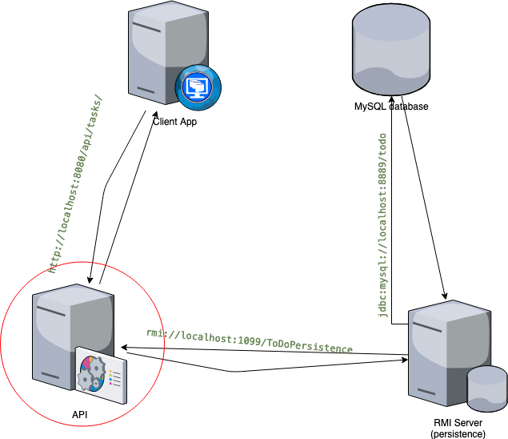

# ToDO-API

This is a simple restful webservice for a Todo-list app built using spring boot.
It is an example of a Logic tier within a 3 tiers architecture. 

It gets data from an [RMI server](https://github.com/konaesan/ToDo-Persistence) and offers
services to interact with them via a [client app](https://github.com/konaesan/ToDo-Client).

